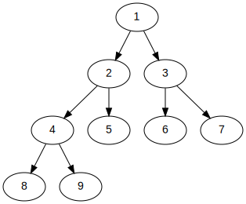

# Rust in a Nutshell

## Why Rust?

## Cargo

## Cargo Doc

## Crates

## Basic Data Structures

### Sequences

#### Vec

#### VecDeque

#### LinkedList

### Maps

#### HashMap

#### BTreeMap

### Sets

#### HashSet

#### BTreeSet

### Other

#### BinaryHeap

## Basic Algorithms

## Other Useful things

## Regex

## Derive Macros

## Counting in O(1) space with slices

# Macros for Rust

## `test!`

Unlike C and C++, a testing framework is built into rust. We can create
our own tests by creating a `mod` block and letting cargo know that we
want to test it.

Let's say we create this function:

`src/add.rs`
```rs
fn add(a: i32, b: i32) -> i32 {
  a + b
}
```

We can test it at the bottom of the file:

`src/add.rs`
```rs
...
#[cfg(test)]
mod test {
  use super::*;

  #[test]
  fn add_one_and_one() {
    assert_eq!(add(1, 1), 2);
  }

  #[test]
  fn add_one_and_two() {
    assert_eq!(add(1, 2), 3);
  }
}
```

Macros let us reduce most of the boilerplate:

`src/lib.rs`
```rs
#[macro_export]
macro_rules! test {
  ($($name:ident: $left:expr, $right:expr,)*) => {
    #[cfg(test)]
    mod test {
      use super::*;
      $(
          #[test]
          fn $name() {
            assert_eq!($left, $right);
          }
       )*
    }
  }
}
```

Test can then be called like so:

`src/add.rs`
```rs
test! {
  add_one_to_one: add(1, 1), 2,
  add_one_to_two: add(1, 2), 3,
}
```

# Introductory

## Contains Duplicate

### Problem

> Given an integer array nums, return true if any value appears at least
> twice in the array, and return false if every element is distinct.

### Intuition


### Test Cases

```rs
[] == false
[1] == false
[1,1] == true
[1,2,3] == false
[1,2,1] == true
```

### Using Sets

If a slice of numbers is the same length as the set of its numbers, we
know that the slice **only contains** unique numbers. With this, we can
find the solution to the problem:

### Complexity

O(n) time, O(n) space. We take O(n) time to convert the slice into the
HashSet, and the HashSet takes O(n) space as well.

### Answer

```rs
use std::collections::HashSet;

pub fn contains_duplicate(nums: &[i32]) -> bool {
  let num_len = nums.len();
  let s: HashSet<&i32> = HashSet::from_iter(nums.iter());
  s.len() != num_len
}
```

# Trees

## Maximum Path through a Binary Tree

```rs
type Node = Option<Rc<RefCell<TreeNode>>>;

pub fn max_path_sum(root: Node) -> i32 {
  let mut max_so_far = i32::MIN;
  fn helper(node: &Node, max_so_far: &mut i32) -> i32 {
    match node {
      Some(n) => {
        let val = n.borrow().val;
        let l = max(0, helper(&n.borrow().left, max_so_far));
        let r = max(0, helper(&n.borrow().right, max_so_far));
        *max_so_far = max(*max_so_far, val + l + r);
        val + max(l, r)
      }
      None => 0,
    }
  }
  helper(&root, &mut max_so_far);
  max_so_far
}
```

## Validate Binary Search Tree

```rs
type Node = Option<Rc<RefCell<TreeNode>>>;

pub fn is_valid_bst(root: Node) -> bool {
  fn helper(node: &Node, possible_min: i64, possible_max: i64) -> bool {
    if let Some(n) = node {
      let borrowed = n.borrow();
      let left = &borrowed.left;
      let right = &borrowed.right;
      let val: i64 = borrowed.val.into();
      if val >= possible_min && val <= possible_max {
        helper(&left, possible_min, val) && \
        helper(&right, val, possible_max)
      } else {
        false
      }
    } else {
      true
    }
  }
  helper(&root, i64::MIN, i64::MAX)
}
```

## Same Tree

```rs
type Node = Option<Rc<RefCell<TreeNode>>>;

pub fn is_same_tree(p: Node, q: Node) -> bool {
  fn is_same(p: &Node, q: &Node) -> bool {
    match (p, q) {
      (Some(left), Some(right)) => {
        let left = left.borrow();
        let right = right.borrow();
        left.val == right.val
          && same(&left.left, &right.left)
          && same(&left.right, &right.right)
      }
      (None, None) => true,
      (None, _) | (_, None) => false,
    }
  }
  is_same(&p, &q)
}
```



