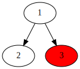

## Validate Binary Search Tree

```rs
type Node = Option<Rc<RefCell<TreeNode>>>;

pub fn is_valid_bst(root: Node) -> bool {
  fn helper(node: &Node, possible_min: i64, possible_max: i64) -> bool {
    if let Some(n) = node {
      let borrowed = n.borrow();
      let left = &borrowed.left;
      let right = &borrowed.right;
      let val: i64 = borrowed.val.into();
      if val >= possible_min && val <= possible_max {
        helper(&left, possible_min, val) && \
        helper(&right, val, possible_max)
      } else {
        false
      }
    } else {
      true
    }
  }
  helper(&root, i64::MIN, i64::MAX)
}
```

## Same Tree

```rs
type Node = Option<Rc<RefCell<TreeNode>>>;

pub fn is_same_tree(p: Node, q: Node) -> bool {
  fn same(p: &Node, q: &Node) -> bool {
    match (p, q) {
      (Some(left), Some(right)) => {
        let left = left.borrow();
        let right = right.borrow();
        left.val == right.val
          && same(&left.left, &right.left)
          && same(&left.right, &right.right)
      }
      (None, None) => true,
        (None, _) | (_, None) => false,
    }
  }
  same(&p, &q)
}
```


